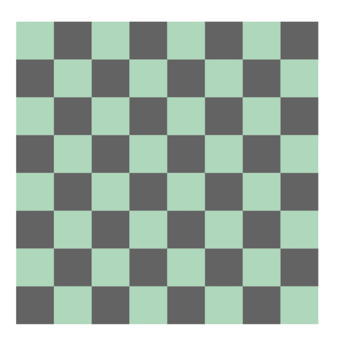

# Checker Champ

## Description

This Checkerboard and gamepiece framework will be utilized as an example with abstracted and reusable code for game-frame implementation. Eventually, this game may be playable. For now, I am creating a grid that has pieces that allows implementation of behaviors such as hover events, mouse events, drag and drop, etc.

## Table of Contents

1. [Images](#images)
2. [Usage](#usage)
3. [Contributing](#contributing)
4. [Tests](#tests)

## Images

## Usage

This project should be utilized as a springboard for future development of games.

## Contributing

Chandra Holt

## Tests

N/A

### GitHub

[GitHub](https://www.github.com/chandrapanda)
